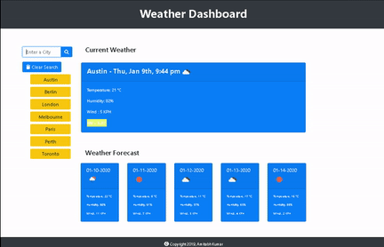
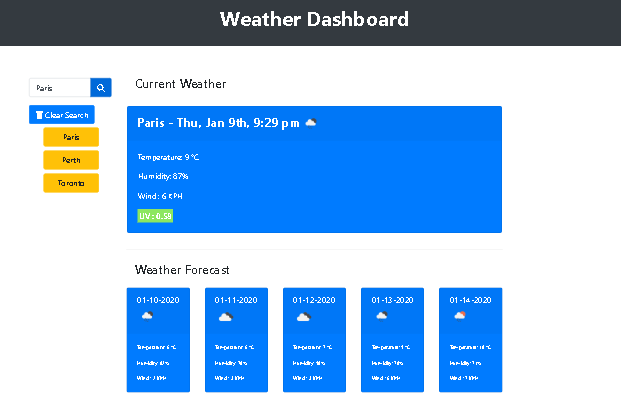

# Weather-Dashboard

## Usage demo

This Weather-Dashboard was created with the intention of helping the user view current weather conditions, as well as the forecast for the 5 coming days. Users can also view past cities searched. The project utilizes HTML, CSS, JavaScript and third-party APIs such as Open Weather. This is the sixth project built as a part of the UNCC Coding Bootcamp.

## Getting Started

Enter a city name in the seach field. The current date and weather will appear. A 5 day forecast for the same city will be posted below the weather. Your search history will be listed on the left side. Click a recently searched city to see it's weather again.

UV Index is displayed color coded based on the [EPA UV Index Scale](https://www.epa.gov/sunsafety/uv-index-scale-0).

Less than 2 - #8DE760
Between 2 and 5 - #E4F06E
Between 5 and 8 - #EBAC57
Greater than 8 - #F34343

  ### Prerequisites

This file opens in all the browsers, but chrome (including chrome for mobile devices) has been deemed as the browser for best results.

### Accessing

This web application / can be accessed via the link https://amitabh-k.github.io/Weather-Dashboard-2.0/

## Running the tests

Use Inspect Element of Google Chrome to test the responsiveness of the webpage’s on various screen sizes.

## Technologies

* HTML
* CSS
* JavaScript
* [Bootstrap](https://getbootstrap.com/)
* [jQuery](https://jquery.com/)
* [OpenWeather](https://openweathermap.org/)

## Author

* **Amitabh Kumar**

## Acknowledgments

* Ali Maqsood & David Bland's (instructors) help on the content delivery

